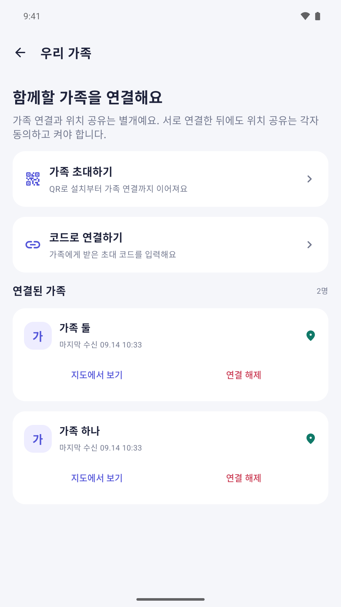
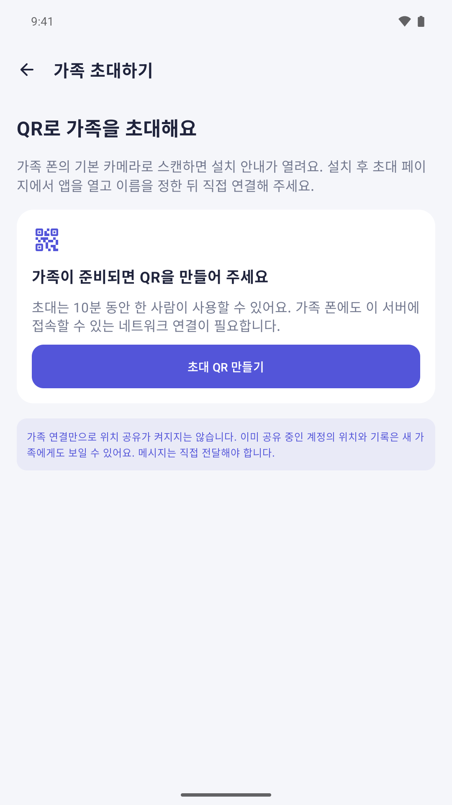
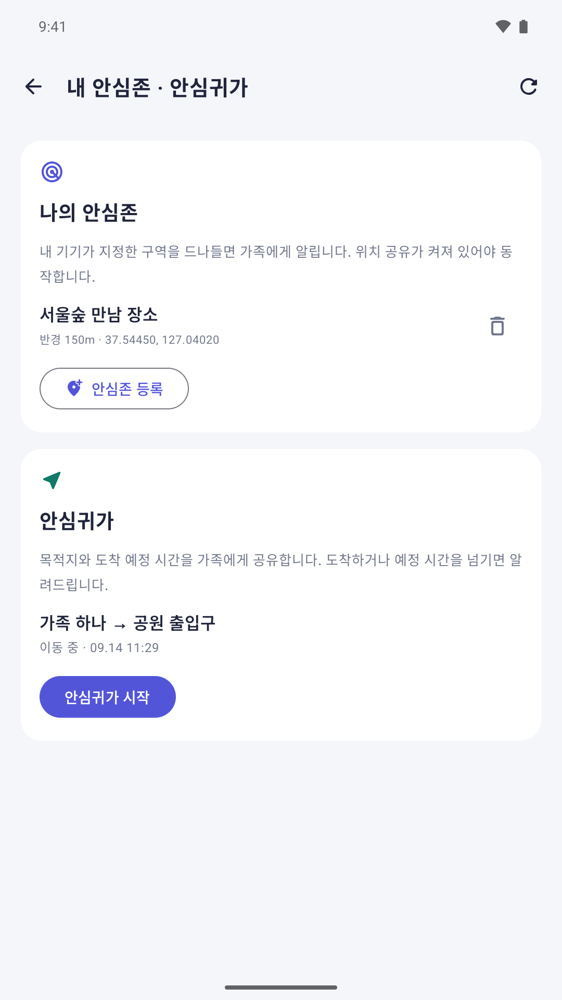

# 어딧 · Eodit

가족의 초대·연결과 동의한 위치 공유를 위한 **Android 앱과 자체 호스팅 Node.js·SQLite 서버**입니다. 이 저장소의 직접 작성한 Android·서버 코드와 앱 리소스는 [MIT License](LICENSE)로 공개합니다. 제3자 SDK·폰트·지도 콘텐츠에는 별도 조건이 적용됩니다([NOTICE](NOTICE)).

## 앱 화면

초대로 가족을 연결하고, **각자 켠 위치 공유**를 바탕으로 내 안심존과 안심귀가를 관리합니다.

| 가족 연결 | QR 초대 | 안심존·안심귀가 |
| :---: | :---: | :---: |
| <a href="docs/images/family-connections.png"></a> | <a href="docs/images/family-invitation.png"></a> | <a href="docs/images/safety-zone-journey.png"></a> |
| 연결된 가족 확인과 연결 해제.<br>위치 공유는 각자 별도로 동의합니다. | 가족이 준비되면 1회용 초대를 발급합니다.<br>초대 링크에는 연결할 서버 정보가 포함됩니다. | 내가 정한 구역과 귀가 일정을 관리합니다.<br>동작에는 내 위치 공유가 필요합니다. |

격리된 에뮬레이터에서 시연용 이름·가상 위치로 촬영한 실제 앱 화면입니다. 이미지를 누르면 크게 볼 수 있습니다. 운영 서버 주소·기기 토큰·실제 초대 코드는 없으며, 별도 권리 검토가 필요한 지도 타일 화면은 포함하지 않았습니다.

**소스 공개이며, APK를 동봉하거나 공용 가족 서버를 제공하지 않습니다. Google Play에도 아직 출시되지 않았습니다.** 앱은 아래 안내로 직접 빌드하고 서버는 본인이 운영해야 합니다. 서버를 설치하거나 초대 링크를 발급하는 것만으로 앱이 설치되지는 않습니다.

**긴급 구조 서비스가 아닙니다.** 사고 감지나 알림 도착을 보장하지 않으며 긴급기관에 자동 신고하지 않습니다. 위급하면 앱 알림을 기다리지 말고 현지 긴급전화(한국 112·119)를 이용하세요. 서버 운영·보안·백업과 기기 동작은 운영자가 확인해야 합니다.

## 기능과 한계

Android 앱은 화면·지도·권한·백그라운드 위치 공유를 담당하고, 서버는 초대·연결·접근 제어·데이터 보관과 다음 기능을 제공합니다.

- 초대 링크·QR 또는 서버 주소와 코드로 참여하고 표시 이름을 정합니다. 이메일·비밀번호·일반 회원가입·로그인·로그아웃은 없습니다.
- 연결된 가족의 공유 중인 최근 위치와 최근 7일 범위의 위치 기록을 조회하고 가족 연결을 해제할 수 있습니다. 기록 조회는 한 요청에 최대 2,000개이므로 모든 측정값의 완전한 보관·내보내기를 뜻하지 않습니다.
- 본인의 안심존 진입·이탈, 안심귀가 도착·예정 시간 경과, 장시간 움직임 미확인·위치 수신 중단에 관한 상태와 이벤트를 제공합니다. 가족의 안심존을 대신 관리하는 기능은 아닙니다. 위치가 오지 않는 것과 움직이지 않는 것은 다릅니다.
- **가족 연결만으로 위치 공유가 시작되지 않습니다.** 위치 공유와 클라이언트의 백그라운드 보호자 알림은 별도 설정입니다.
- FCM/푸시 기반의 실시간 전달 보장, 상용 BLE 반지 연동, 카카오톡 발송은 없습니다. 서버에는 기존 SOS·첨부 데이터용 API도 있으므로 해당 데이터까지 보호해야 합니다.

어딧 앱은 Android 전용이며 iOS 앱은 없습니다. NAVER 지도 표시와 위치·알림 권한은 앱에서 처리합니다. Android 화면에는 SOS 촬영·녹음·전송 기능이 없습니다. 공유 중 위치 서비스는 알림을 표시하는 포그라운드 서비스로 동작하며, 오프라인 위치를 디스크에 쌓아 나중에 모두 전송하는 구조가 아닙니다. 보호자 알림은 WorkManager 주기 작업으로 **15분 이상 지연될 수 있습니다**.

GPS 오차, 실내 환경, 기기 권한, 절전·제조사 정책, 네트워크 단절, 서버 중단, 앱 강제 종료로 기록과 알림이 누락될 수 있습니다. 24시간 감시·무중단 서비스가 아닙니다.

## 구성과 신뢰 경계

```text
어딧 Android 앱 ────── HTTPS ── 역방향 프록시/TLS ── Node.js 서버 ── SQLite·첨부 파일
초대 웹페이지 ───────── HTTPS ────────────────┘
                                             └─ 선택: 운영자가 빌드·서명한 APK 제공
```

- `android/app/src/`: Kotlin·Compose Android 앱과 직접 작성한 리소스
- `android/`의 Gradle 설정·실행 스크립트와 `gradle/wrapper/`: 앱 빌드 도구(Gradle 8.9 wrapper 포함)
- `server/src/`: Node 내장 HTTP·SQLite 기반 서버와 첫 기기 초대 CLI
- `server/test/`: 서버 API·보안·상태 관련 테스트
- 루트의 `Dockerfile`, `compose.yml`, `Caddyfile`: 서버 배포 설정
- `distribution/`: 선택적으로 운영자가 APK를 두는 디렉터리. 저장소에는 APK가 없습니다.

`docs/images/`에는 공개 검토를 마친 위 시연 화면 세 장만 포함합니다. `android/store/`의 전체 스토어 소재·원본 캡처·지도 이미지는 공개 범위에서 제외합니다. 로컬 SDK 설정·키·캐시·빌드 결과·운영 데이터도 제외합니다. 기존 설치와 서버 호환성을 위해 패키지 ID `org.ansim.link`, 초대 프로토콜 `ansimlink://`, DB·저장소 이름, APK 경로 `/downloads/ansim-link.apk` 및 저장소 URL의 `ansim-link`는 유지합니다. 제품 이름은 어딧(Eodit)입니다.

서버 실행에 별도 npm 의존성 설치는 필요하지 않습니다. 위치·표시 이름·가족 연결·안심존·귀가 상태 등은 **운영자가 지정한 서버 저장소**에 보관됩니다. 서버 관리자와 저장소·백업 접근자는 민감한 데이터를 읽을 수 있습니다. 종단간 암호화가 아닙니다.

Android 앱의 NAVER 지도 요청은 기기 IP와 조회 영역을 지도 제공자에게 전달합니다. 외부 TLS 프록시·터널을 선택하면 그 제공자도 통신 경로와 신뢰 경계에 포함됩니다. 초대 URL과 기기 토큰은 공개하지 말고, 프록시 접근 로그에도 초대 코드 등 민감한 정보가 남을 수 있음을 고려하세요. 자세한 내용은 [SECURITY.md](SECURITY.md)를 읽어 주세요.

## 준비물

| 준비물 | 필요한 이유·조건 |
| --- | --- |
| 서버 실행 환경 | **Node.js 24 LTS 또는 Docker Engine/Desktop + Docker Compose v2** 중 하나. 최소 Node 요구는 22.13이지만 이 안내는 내장 SQLite를 포함한 Node 24 기준입니다. |
| 계속 켜 둘 서버 | Linux 서버/VPS 또는 절전하지 않는 Mac 등. 안정적인 전원·인터넷·저장 공간과 운영 권한이 필요합니다. 노트북을 닫거나 Mac을 재우면 서비스가 끊길 수 있습니다. |
| 고정된 HTTPS 주소 | 실제 기기 연결에는 본인이 관리하는 도메인·DNS와 유효한 TLS 인증서·역방향 프록시가 필요합니다. 아래 Caddy 방식은 외부에서 도달 가능한 TCP 80·443 포트가 필요합니다. 로컬 서버 검증에는 도메인이 필요하지 않습니다. |
| 영구 저장소와 백업 | SQLite와 첨부 파일을 재시작·업데이트 후에도 유지하고 일관되게 백업할 수 있어야 합니다. |
| 명령행 도구 | 아래 예시는 macOS/Linux 셸, 소스를 받기 위한 Git, HTTP 확인용 curl을 사용합니다. |
| Android 빌드 환경 | 앱을 빌드할 때만 **JDK 17**, Android SDK Platform 35, SDK Build-Tools 34.0.0(AGP 8.7 기본값), command-line tools가 필요합니다. 설치에는 platform-tools의 `adb`와 Android 8.0(API 26) 이상 기기 또는 에뮬레이터가 필요합니다. |
| NAVER Cloud 계정 | 실제 지도 표시를 사용할 때 본인 명의 Maps 애플리케이션과 Key ID가 필요합니다. 키 없이도 앱을 빌드할 수 있지만 지도는 표시되지 않습니다. |

**JDK, Android SDK, Gradle, NAVER 지도 키, APK 서명 키는 서버 실행·첫 초대 발급·API 테스트의 준비물이 아닙니다.** 서버는 지도 키 없이 실행됩니다. 서버/VPS 또는 전력, 도메인, 네트워크, 백업, 선택한 터널과 APK 전송량에 비용이 들 수 있습니다. 지도 서비스 사용량·요금·쿼터는 NAVER Cloud의 조건을 확인하세요.

## 1. 소스와 설정 준비

다음 명령은 macOS/Linux 셸 기준입니다. 예시 `family.example.com`을 본인 도메인으로 바꾸세요. 별도 표시가 없으면 저장소 루트에서 실행합니다.

```sh
git clone https://github.com/krongggggg/ansim-link.git
cd ansim-link
cp .env.example .env
mkdir -p distribution
```

`distribution/`은 Compose 마운트를 위한 빈 디렉터리여도 됩니다. APK는 필수가 아닙니다. 루트의 `.env`를 편집하고 커밋하지 마세요.

```dotenv
DOMAIN=family.example.com
PUBLIC_BASE_URL=https://family.example.com
HOST=127.0.0.1
PORT=8080
DATA_DIR=./data
ANDROID_APK_PATH=../distribution/ansim-link.apk
TRUST_PROXY=true
ALLOW_INSECURE_INVITES=false
```

### 설정과 상대 경로 규칙

- `PUBLIC_BASE_URL`은 기기가 접근할 **원점**(스킴·호스트·선택적 포트)입니다. `/invite` 등 경로·쿼리·사용자 정보를 넣지 않습니다. 서버는 요청 헤더에서 이 주소를 추측하지 않습니다. 설정하지 않아도 서버는 시작되지만 공개 초대 페이지와 첫 기기 CLI를 사용하려면 필요합니다.
- Node는 `.env`를 자동으로 읽지 않습니다. 아래처럼 **`server/`에서 `--env-file=../.env`로 실행**합니다. 이미 export한 환경 변수는 env 파일보다 우선하므로 서비스 관리자와 셸 설정도 확인하세요.
- 상대 `DATA_DIR`와 `ANDROID_APK_PATH`는 **프로세스의 작업 디렉터리 기준**입니다. `.env` 파일 위치가 기준이 아닙니다. 안내대로 `server/`에서 실행하면 `DATA_DIR=./data`는 `server/data/`, APK 예시 경로는 루트의 `distribution/ansim-link.apk`입니다. 다른 작업 디렉터리를 쓴다면 절대 경로를 사용하세요.
- APK 경로는 선택 사항입니다. 코드상 미설정 상태는 APK 제공 비활성화이며, 위 경로는 `.env.example`의 운영 예시입니다. 파일이 없거나 읽을 수 없어도 서버 시작·초대 발급·API 테스트는 가능합니다.
- Compose는 루트 `.env`를 보간에 사용합니다. 컨테이너에서는 `HOST=0.0.0.0`, `PORT=8080`, `DATA_DIR=/data`, `ANDROID_APK_PATH=/distribution/ansim-link.apk`, `TRUST_PROXY=true`가 Compose 설정으로 지정됩니다. `.env`의 같은 이름을 바꿔도 이 고정값은 바뀌지 않습니다. 데이터는 named volume, APK는 호스트 `./distribution`의 읽기 전용 마운트입니다.
- `TRUST_PROXY=true`는 신뢰하는 프록시만 서버에 접근하고 전달 IP 헤더를 올바르게 설정할 때만 사용하세요. 프록시 없는 직접 Node 테스트에서는 `false`로 설정합니다. Compose가 호스트에 공개하는 8080은 `127.0.0.1`로 제한됩니다. **8080을 공용 인터넷에 노출하지 마세요.**
- `ALLOW_INSECURE_INVITES=true`는 HTTP 초대를 위한 개발 전용 설정입니다. 운영에서는 HTTPS와 `false`를 사용하세요. `PORT`는 1~65535 정수, 두 불리언 설정은 정확히 `true` 또는 `false`여야 합니다.

## 2. 클라이언트 없이 로컬 서버 검증

Node 24만으로 서버 응답과 사용자가 0명인 저장소의 첫 초대 발급을 확인할 수 있습니다. 아래는 운영 `.env`를 읽지 않고 **별도 `server/data-local/`**을 쓰는 로컬 예시입니다. 운영 서버와 같은 포트로 동시에 실행하지 마세요.

첫 터미널에서, 저장소 루트 기준:

```sh
cd server
HOST=127.0.0.1 PORT=8080 DATA_DIR=./data-local \
  PUBLIC_BASE_URL=http://127.0.0.1:8080 \
  TRUST_PROXY=false ALLOW_INSECURE_INVITES=true \
  node src/index.mjs
```

두 번째 터미널에서, 저장소 루트 기준:

```sh
curl --fail http://127.0.0.1:8080/health
cd server
DATA_DIR=./data-local PUBLIC_BASE_URL=http://127.0.0.1:8080 \
  TRUST_PROXY=false ALLOW_INSECURE_INVITES=true \
  node src/bootstrap.mjs
```

정상적인 `/health` 응답은 `{"ok":true}`입니다. CLI가 출력한 URL을 같은 컴퓨터의 브라우저에서 열면 첫 기기 초대 안내를 볼 수 있습니다. **페이지를 보는 것만으로 사용자가 만들어지거나 초대가 소비되지는 않습니다.** APK가 없으면 다운로드 버튼 대신 설치 파일이 준비되지 않았다는 안내가 나옵니다. HTTP 개발 초대는 휴대전화 운영용으로 쓰지 마세요. 기기에서 `127.0.0.1`은 서버가 아니라 그 기기 자신입니다.

서버 API 테스트는 저장소 루트에서 다음과 같이 실행합니다. 앱·APK·지도 키는 필요하지 않습니다.

```sh
cd server
npm test
```

이 절은 **서버만의 검증**입니다. 앱을 빌드·설치하거나 휴대전화 위치 공유·지도·알림 동작을 증명하지 않습니다. 로컬 서버는 첫 터미널에서 Ctrl+C로 정상 종료합니다. 로컬 데이터는 운영 데이터와 섞지 마세요.

## Android 앱 빌드·설치

현재 소스는 **minSdk 26, compileSdk/targetSdk 35, 버전 1.1.0(code 2)**입니다. AGP 8.7.3·Kotlin 2.0.21을 사용합니다. [AGP 8.7 호환 표](https://developer.android.com/build/releases/agp-8-7-0-release-notes)에 맞춰 JDK 17과 포함된 **Gradle 8.9 wrapper**를 사용하세요. 시스템 Gradle을 따로 설치할 필요는 없습니다. wrapper JAR과 배포 ZIP SHA-256 설정을 포함하며 CI에서 wrapper JAR 무결성을 검증합니다.

### SDK와 지도 키

Android Studio의 SDK Manager 또는 Android SDK command-line tools로 다음 구성요소를 설치하고 SDK 약관을 확인·수락합니다. `sdkmanager`와 `adb`가 PATH에 있어야 합니다. SDK 위치는 `ANDROID_HOME` 또는 무시되는 `android/local.properties`의 `sdk.dir`로 지정하고, `JAVA_HOME`은 JDK 17을 가리키게 하세요. 개인 경로는 커밋하지 않습니다.

```sh
sdkmanager --licenses
sdkmanager "platform-tools" "platforms;android-35" "build-tools;34.0.0"
```

지도 사용 시 [NAVER 공식 시작 안내](https://navermaps.github.io/android-map-sdk/guide-ko/1.html)에 따라 **본인 NAVER Cloud 계정**의 Maps 애플리케이션을 등록하고 **Dynamic Map**을 활성화합니다. Android 패키지 허용 목록에는 정확히 `org.ansim.link`를 등록하고 발급된 **Maps Key ID**를 사용하세요. 서버용 Secret Key나 계정 접근 키를 앱에 넣지 않습니다. 패키지 제한·사용량 한도·요금 알림을 설정하고 불필요한 API 권한을 열지 마세요. APK의 Key ID는 추출 가능하므로 비밀 보관 수단이 아니며, 키를 소스·이슈·빌드 로그에 공개하지 않는 것만으로 남용을 막을 수는 없습니다.

설정 우선순위는 다음과 같습니다. 선택된 값을 trim하며, 상위 설정이 빈 문자열이면 하위 설정으로 재시도하지 않습니다.

1. Gradle 프로젝트 속성 `-PnaverMapKeyId=...`
2. 환경 변수 `NAVER_MAP_KEY_ID`
3. 무시되는 `android/local.properties`의 `naverMapKeyId=...`
4. 모두 없으면 빈 값

로컬에서는 기존 `android/local.properties`의 `sdk.dir`를 지우지 말고 `naverMapKeyId`를 추가하는 방식을 권합니다. 명령행 `-P`는 셸 기록·프로세스 목록에 남을 수 있습니다. 서버 `.env`는 Android 빌드가 읽지 않습니다. 키를 바꿨다면 다시 빌드해야 합니다.

**키 없이도 debug와 unsigned release가 빌드됩니다.** 앱의 지도 영역에 “네이버 지도 설정 필요” 안내가 나오고 지도는 생성되지 않습니다. 초대·서버 API 등 지도와 무관한 기능을 확인할 수 있으나 지도 동작 검증을 대신하지 않습니다. 임의의 가짜 키를 넣거나 이 안내를 우회하지 마세요. 키가 있어도 잘못된 패키지 등록, Dynamic Map 미활성화, 쿼터·네트워크 문제는 지도 인증 실패를 일으킬 수 있습니다.

### Debug 빌드와 개발용 설치

저장소 루트에서:

```sh
cd android
./gradlew --no-daemon :app:assembleDebug
adb install -r app/build/outputs/apk/debug/app-debug.apk
```

Windows에서는 `gradlew.bat`를 사용합니다. Android Studio를 쓴다면 `android/`를 열고 Gradle JDK도 17로 설정하세요. 첫 빌드는 Google Maven·Maven Central·Gradle 및 NAVER Maven에서 의존성을 받으므로 인터넷 연결이 필요합니다.

debug는 SDK의 개발용 서명으로 설치되며 **개발 테스트에 한해 HTTP 서버 주소와 평문 통신을 허용**합니다. release는 서버 주소 검증과 Android cleartext 정책 모두 **HTTPS만 허용**합니다. HTTP는 debug에서 추가로 허용되는 것이지 필수는 아닙니다. 서버의 HTTP 초대 설정도 별도로 필요합니다. 위 로컬 서버 예시에 USB 연결 개발 기기를 붙이는 경우 `adb reverse tcp:8080 tcp:8080` 후 `http://127.0.0.1:8080`을 사용할 수 있습니다. 개발 기기·합성 데이터만 사용하고 실제 가족 위치·기기 토큰을 HTTP로 보내지 마세요.

debug와 release는 같은 패키지 ID를 사용합니다. 기존 앱과 서명이 다르면 `adb install -r`도 업데이트할 수 없습니다. **기존 앱을 삭제하거나 데이터를 지워 해결하지 마세요.** 기기 신원·Keystore 키를 잃으므로 별도 개발 기기나 에뮬레이터를 사용합니다.

### Unsigned release와 실제 배포

저장소 루트에서:

```sh
cd android
./gradlew --no-daemon :app:assembleRelease
```

결과는 `android/app/build/outputs/apk/release/app-release-unsigned.apk`입니다. 프로젝트에는 release `signingConfig`가 없으므로 **이 파일은 설치 가능한 서명된 배포 APK가 아닙니다**. 실제 배포자는 [Android 앱 서명 안내](https://developer.android.com/studio/publish/app-signing)에 따라 본인 키로 서명하고 서명을 검증해야 합니다. Android Studio의 Generate Signed Bundle / APK 또는 SDK의 `zipalign`·`apksigner`를 사용하며 키·암호·서명된 산출물을 저장소나 공개 CI에 넣지 않습니다. 기존 설치를 업데이트하려면 기존 서명 키·패키지 ID와 버전 정책을 유지하고 키를 안전하게 백업하세요. 소스 공개로 기존 배포자의 서명 키가 제공되지는 않습니다.

CI는 비공개 지도 키·release 서명 키 없이 debug와 unsigned release를 빌드하며 **APK 업로드·GitHub Release·Play 배포를 하지 않습니다**. CI 빌드 성공은 실제 지도 인증·위치 서비스·알림·기기 설치 검증이 아닙니다.

**이 작업은 Google Play 출시가 아닙니다.** 현재 targetSdk 35는 그대로 유지합니다. [Google Play 공식 정책](https://support.google.com/googleplay/android-developer/answer/11926878?hl=en)에 따르면 2026-08-31부터 일반 Android 신규 앱·업데이트 제출에는 API 36 이상이 필요합니다. 향후 제출 전 SDK·AGP 및 동작 호환성 전환, 실제 서명/AAB, 개인정보·위치 권한·데이터 보안 양식, SDK/네이티브 라이브러리의 16 KB 페이지 크기 호환성 등 당시 정책을 별도로 검증해야 합니다. 현재 소스를 곧바로 제출 가능한 제품으로 간주하지 마세요.

## 3. 운영 서버와 HTTPS 실행

다음 A 또는 B를 선택하세요. 둘을 같은 포트·저장소에 동시에 실행하지 마세요. APK 없이 시작할 수 있습니다.

### A. Docker Compose + Caddy

도메인의 A/AAAA 레코드가 서버를 가리켜야 합니다. 잘못된 IPv6 레코드도 정리하세요. 공유기 NAT·방화벽·클라우드 보안 그룹에서 외부 TCP 80·443이 이 서버에 도달하고 다른 프로그램과 충돌하지 않아야 합니다. CGNAT 등으로 인바운드가 불가능하면 VPS 또는 아래 선택적 HTTPS 터널을 검토하세요.

루트 `.env`에 `DOMAIN=family.example.com`, `PUBLIC_BASE_URL=https://family.example.com`을 설정한 뒤:

```sh
docker compose --profile production up -d --build
docker compose ps
docker compose logs --tail=100 server https
curl --fail https://family.example.com/health
```

Caddy의 `production` 프로필은 도메인의 TLS 발급·갱신과 `server:8080` 프록시를 담당합니다. 데이터는 Compose의 `safety-data` named volume, 인증서 등은 `caddy-data`/`caddy-config` volume에 남습니다. 프로젝트 이름을 바꾸면 다른 volume이 선택될 수 있으니 기존 배포 이름과 실제 volume 이름을 기록하세요. **`docker compose down -v`는 영구 데이터를 삭제하므로 일반 종료·업데이트에 사용하지 마세요.**

### B. Node.js 직접 실행 + 본인 HTTPS 프록시

Node 24를 설치하고 저장소 루트에서:

```sh
cd server
node --env-file=../.env src/index.mjs
```

포그라운드 실행입니다. 같은 서버의 다른 터미널에서 `curl --fail http://127.0.0.1:8080/health`로 로컬 응답을 확인합니다. 상시 운영하려면 본인 환경의 서비스 관리자(예: systemd/launchd)에 같은 작업 디렉터리·환경·정상 종료를 구성하세요. 위 명령만으로 부팅 시 자동 실행이 설정되지는 않습니다.

본인의 Caddy/Nginx 등에서 `https://family.example.com`의 유효한 인증서를 제공하고 `http://127.0.0.1:8080`으로 프록시하세요. 저장소 `Caddyfile`의 upstream `server:8080`은 **Compose 내부 서비스 이름**이므로 호스트에서 그대로 쓰면 안 됩니다. 호스트의 프록시는 loopback upstream과 신뢰할 수 있는 전달 IP 헤더 설정을 사용해야 합니다. 외부 네트워크에서도 `https://family.example.com/health`가 열리는지 확인하세요.

환경 변수를 이미 셸/서비스 관리자에 export했다면 `server/`에서 `npm start`를 써도 됩니다. 단, `npm start` 자체는 루트 `.env`를 로드하지 않습니다.

### 선택 사항: 외부 HTTPS 터널

본인 계정으로 만든 Cloudflare Tunnel이나 Tailscale HTTPS Serve 등으로 loopback 서버를 노출할 수도 있습니다. 이 저장소는 터널·계정·토큰·도메인·자동 시작 설정을 제공하지 않습니다. 제공자의 공식 안내에 따라 **안정적인 HTTPS 원점**을 확보한 뒤 그 주소를 `PUBLIC_BASE_URL`로 설정하세요. Compose 백엔드만 쓴다면 다음 명령으로 시작하고 터널을 로컬 `127.0.0.1:8080`에 연결합니다.

```sh
docker compose up -d --build server
```

이 경우 Caddy `production` 프로필을 함께 켤 필요는 없습니다. 터널은 SQLite와 선택적 APK를 클라우드 저장소나 Workers로 옮기지 않습니다. 원래 서버와 터널 연결 프로그램을 계속 켜 두어야 합니다. 비공개 Tailscale 네트워크를 선택했다면 초대받는 기기도 해당 네트워크에 접근할 수 있어야 합니다. 제공자의 TLS 종료·로그·요금·접근 정책을 검토하고 터널 자격 증명을 커밋하지 마세요.

**HTTP는 개발 테스트에만 사용하세요.** 서버의 HTTP 초대 허용은 앱의 전송 정책을 바꾸지 않습니다. 어딧 release 앱은 HTTPS만 허용하고 debug만 HTTP를 추가로 허용합니다. 운영 환경의 TLS 오류를 인증서 검증 해제나 HTTP 전환으로 우회하지 마세요.

## 4. 첫 기기 초대와 가족 연결

첫 기기 초대는 **사용자가 0명인 서버에서만** 발급할 수 있는 로컬 운영자 작업입니다. APK 없이 발급할 수 있지만, 실제 참여에는 위 안내로 빌드·설치한 어딧 앱이 필요합니다. 운영 서버와 **같은 데이터 저장소·환경 변수**를 사용하세요.

Docker Compose(루트에서):

```sh
docker compose exec server node src/bootstrap.mjs
```

Node 직접 실행(별도 터미널, 루트에서):

```sh
cd server
node --env-file=../.env src/bootstrap.mjs
```

이미 변수를 export한 환경에서는 `server/`에서 `npm run init-family`도 가능합니다. 이 스크립트 역시 `.env`를 자동으로 읽지 않습니다. 출력된 초대 URL은 비공개로 전달하고 터미널 기록·스크린샷을 공개하지 마세요.

앱을 빌드·설치한 뒤의 연결 절차:

1. 첫 휴대전화에 본인이 빌드·서명했거나 신뢰하는 운영자가 제공한 어딧 앱을 설치합니다. 운영자가 선택적으로 APK를 호스팅한다면 초대 페이지에서 내려받을 수 있습니다. 출처와 서버 운영자를 확인하고 설치를 직접 승인하세요. 저장소에 동봉된 APK나 Google Play 설치 경로는 없습니다.
2. 설치 뒤 **같은 초대 웹페이지로 돌아와 ‘앱에서 초대 열기’**를 선택합니다. 이미 설치했다면 바로 열 수 있습니다. 설치만으로 초대 상태가 앱에 자동 이전되지 않습니다. 호환 클라이언트에서 링크를 붙여넣거나 서버 주소와 코드를 입력할 수도 있습니다.
3. 서버와 초대 내용을 확인하고 표시 이름을 정해 참여합니다. 이름은 인증 비밀번호가 아닙니다.
4. 참여한 기기에서 새 가족 초대 QR/링크를 만들고 상대방에게 비공개로 전달합니다. 이미 **같은 서버**에 참여한 기기는 일반 가족 초대를 수락해 기존 프로필에 연결을 추가합니다. 다른 서버의 프로필과 자동 통합되지 않습니다.
5. 가족 연결은 초대한 사람과 받은 사람 사이에 생깁니다. 다른 모든 가족과 자동 연결되는 그룹 가입이 아닙니다.
6. 위치를 보여 줄 사람은 **별도로 공유에 동의하고 켭니다**. 클라이언트의 위치·알림 권한도 확인하세요. 이미 공유 중인 사람과 새로 연결하면 그 사람의 남아 있는 최근 위치 기록이 새 가족에게 보일 수 있습니다.

초대는 **10분, 한 사람, 한 번**입니다. 같은 발급자가 새 초대를 만들면 이전 초대는 대체됩니다. 페이지를 보기만 해서는 소비되지 않지만 실제 참여·연결에 사용하면 재사용할 수 없습니다. 설치 중 만료됐다면 새 초대를 받으세요. 사용자가 생긴 뒤 첫 기기 CLI를 다시 실행해 추가 프로필을 만드는 방식은 지원하지 않습니다.

## 기기 토큰·공유 중지·삭제

- 서버의 기기 세션 토큰은 **자동 만료되지 않는 지속 자격 증명**입니다. 토큰 보유가 해당 프로필의 권한이며 표시 이름만으로 인증하거나 복구할 수 없습니다. 일반 로그아웃이나 비밀번호 복구 경로도 없습니다. 서버에는 토큰 해시가 저장되지만 원본 토큰을 유출하면 해당 기기 권한을 빼앗길 수 있습니다.
- Android 앱은 암호화한 기기 세션을 앱 종료·정상 업데이트 후에도 유지합니다. 다만 **업데이트·재부팅·설치 후 또는 강제 종료 후에는 앱을 직접 열고 공유 상태를 확인**하세요. 위치 서비스가 자동으로 재개된다고 가정하지 말고 필요하면 다시 동의해 공유를 켜세요.
- 위치 기록은 서버에서 7일 보관 범위로 관리됩니다. 공유를 끄면 클라이언트는 새 전송을 중단하고 서버에 저장된 해당 프로필의 위치 기록 삭제를 요청합니다. 서버 반영 시 진행 중·예정 시간 경과 상태의 안심귀가도 취소됩니다. **오프라인이면 서버 반영은 보류**되므로 클라이언트의 완료 상태를 확인해야 합니다. 공유 중지는 프로필·가족 연결·모든 종류의 데이터 삭제와 같지 않습니다.
- 가족 연결 해제는 두 사람 사이의 접근을 끊는 기능이지 상대방의 프로필이나 서버의 위치 기록을 삭제하는 기능이 아닙니다. 다시 연결했을 때 상대가 공유 중이면 남아 있는 최근 기록에 접근할 수 있습니다.
- 현재 표시 이름을 **정확히 입력해 본인 프로필을 삭제**하면 서버의 해당 프로필과 연결된 데이터·자격 증명이 삭제/폐기됩니다. 다른 가족의 프로필을 삭제하는 기능은 아닙니다. 서버 연결 없이 삭제 완료로 간주하지 마세요. 첨부 파일 삭제 실패는 서버가 재시도하며 백업까지 지우는 기능은 아닙니다.
- 앱 제거·데이터 지우기는 서버 프로필 삭제가 아닙니다. Android 앱의 로컬 기기 식별 정보와 Android Keystore 키를 잃으면 이전 프로필로 돌아갈 수 없습니다. 자동 백업은 비활성화되어 있으며 환경설정 파일만 복사해도 복호화 키가 복원되지 않습니다. 기기 자격 증명과 서버 데이터가 일관되게 복원되지 않는다면 새 초대는 **새 프로필**을 만듭니다. 이름만 같게 입력해도 복구되지 않습니다.
- 모든 기기 자격 증명을 잃었는데 서버에 사용자가 남았다면 첫 기기 CLI로 우회할 수 없습니다. 데이터를 지우기 전에 운영자와 백업·기존 프로필 처리 방법을 확인하세요.

## 선택 사항: 서명한 APK 호스팅

이 저장소는 앱 소스와 빌드 방법을 제공하지만 APK를 동봉하지 않습니다. 운영자가 **지도 설정·배포 권한·서명·호환성을 확인한 설치 파일을 준비했을 때만** 기존 다운로드 경로를 사용할 수 있습니다. unsigned release나 개발용 debug APK를 운영 배포에 쓰지 마세요. APK가 없어도 서버 시작·첫 초대 발급·API 테스트는 가능합니다.

직접 Node 실행에서는 `.env.example`의 `ANDROID_APK_PATH=../distribution/ansim-link.apk`가 예시 경로입니다. 설정하지 않으면 APK를 제공하지 않습니다. Compose는 호스트 `./distribution`을 읽기 전용으로 마운트하고 컨테이너의 `/distribution/ansim-link.apk`를 사용합니다.

파일 출처·무결성·서명과 기존 앱의 업데이트 호환성을 별도로 확인한 뒤 `distribution/ansim-link.apk.new`로 옮기고, 같은 파일시스템 안에서 다음과 같이 게시할 수 있습니다.

```sh
chmod 644 distribution/ansim-link.apk.new
mv -f distribution/ansim-link.apk.new distribution/ansim-link.apk
curl --fail --head https://family.example.com/downloads/ansim-link.apk
```

다운로드 중인 최종 파일에 직접 덮어쓰지 않고 rename으로 교체합니다. 서버는 파일을 제공할 뿐 APK 서명이나 안전성을 검증하지 않습니다. `/downloads/ansim-link.apk`는 인증 없이 접근하는 공개 다운로드 경로이므로 비밀 파일을 두지 마세요.

파일이 없거나 경로가 미설정·읽기 불가인 경우 다운로드 요청은 **HTTP 503**을 반환하고 초대 페이지는 다운로드 버튼을 숨깁니다. 이미 설치한 앱으로 초대를 여는 안내는 유지됩니다. APK 미제공으로 인한 503은 서버 시작 실패를 뜻하지 않습니다. 앱 자동 업데이트 기능도 없으므로 운영자는 새 버전의 안전한 설치·업데이트 방법을 사용자에게 안내해야 합니다.

## 운영·스키마 v2 이전·백업·업데이트

기본 점검 명령(루트에서, Compose 운영 기준):

```sh
curl --fail https://family.example.com/health
docker compose ps
docker compose logs --tail=100 server
```

`/health` 성공은 서버 HTTP 응답만 확인합니다. 지도 인증, 기기 권한, 위치 공유·알림 전달이나 데이터 복구까지 증명하지 않습니다. 앱을 설치한 운영자 본인의 두 기기로 초대·별도 공유 동의·위치 확인·공유 중지의 전체 흐름을 확인하세요. 공개 이슈에 실사용 데이터나 초대 링크를 첨부하지 마세요.

**서버 버전 변경 전에 일관된 백업을 확보하세요.** 서버 시작 시 현재 스키마 v2로 이전하며, v1의 사용자 ID·가족 연결·데이터와 아직 유효한 세션을 유지합니다. 이전된 유효 세션은 지속 기기 자격 증명이 되고 이미 만료된 세션은 되살리지 않습니다. 지원 범위를 넘는 DB 버전이나 버전 정보가 없는 기존 DB는 자동 변경하지 않습니다. DB 다운그레이드는 보장하지 않습니다.

- **직접 Node 운영:** 서비스를 정상 종료하고 bootstrap 등 모든 DB 접근 프로세스가 멈춘 상태에서 `DATA_DIR` 전체(기본 `server/data/`)를 백업합니다. 실행 중 `ansim.sqlite`만 복사하지 마세요. WAL·SHM 및 `media/` 첨부 파일을 누락하면 일관성을 잃을 수 있습니다.
- **Docker 운영:** `docker compose stop server` 후 다른 DB 접근 프로세스도 없는지 확인하고 Docker의 volume 백업 절차로 실제 프로젝트의 `safety-data` volume 전체를 보관합니다. 운영 설정과 필요 시 Caddy 인증서 volume, 별도 제공 중인 APK도 따로 보관합니다. 백업 후 기존 버전을 재개하려면 `docker compose start server`를 사용합니다.
- **백업 보호:** 위치·가족 관계·이전 첨부·세션 해시 등 민감한 정보가 있으므로 저장 매체 암호화, 접근 제한, 별도 보관, 복원 연습과 **보존·만료 정책**이 필요합니다. 앱에서 삭제한 데이터도 오래된 백업에는 남을 수 있습니다. 실사용자 데이터의 공개 테스트 복원은 하지 마세요.
- **복원:** 백업과 호환되는 서버 버전을 사용하고 복원 중에는 서비스를 멈춥니다. 소유권·접근 권한, 올바른 `DATA_DIR` 또는 volume 연결을 확인하세요. 백업 시점 이후의 변경·삭제가 사라지거나 되돌아올 수 있습니다. 서버 DB 복원만으로 기기에서 잃은 원본 토큰이나 복호화 키가 복구되지는 않습니다.

백업 후 변경 내용을 검토한 새 소스로 갱신합니다. Docker는 저장소 루트에서 다음과 같이 다시 빌드·기동합니다.

```sh
docker compose --profile production up -d --build
curl --fail https://family.example.com/health
```

직접 Node는 기존 서비스를 정상 종료한 뒤 `server/`에서 같은 환경으로 `node --env-file=../.env src/index.mjs`를 실행하거나 구성한 서비스 관리자로 재시작합니다. **기존 데이터 경로·Compose 프로젝트 이름·volume을 유지**하세요. 서버 업데이트는 Android 앱의 설치·업데이트를 수행하지 않습니다.

## 문제 해결

| 증상 | 확인할 사항 |
| --- | --- |
| 서버 초기화 실패 | Node 24 사용 여부, `DATA_DIR` 권한, `PUBLIC_BASE_URL` 형식, 포트·불리언 설정을 확인합니다. 직접 실행의 작업 디렉터리와 env 파일 로드 여부도 확인하세요. |
| `/health`는 정상인데 휴대전화에서 쓸 앱이 없음 | `android/`의 앱을 위 안내로 빌드·설치하세요. 서버 시작만으로 앱이 설치되지 않습니다. APK는 동봉되지 않고 Google Play에도 아직 출시되지 않았습니다. |
| 초대는 열리는데 APK 다운로드가 503 | APK 미제공이면 정상적인 상태입니다. 호스팅하기로 했다면 파일의 실제 위치·읽기 권한, 직접 Node의 상대 경로와 `ANDROID_APK_PATH`, Compose mount를 확인합니다. |
| HTTPS 연결 실패 | 도메인·DNS A/AAAA·80/443·인증서 체인·서버/기기 시간을 확인합니다. `PUBLIC_BASE_URL`과 실제 접속 원점이 같아야 합니다. 인증서 검증을 끄거나 운영을 HTTP로 바꾸지 마세요. |
| 초대 만료·이미 사용됨 | 새 초대를 요청합니다. 10분 제한과 서버 시각을 확인하세요. 첫 기기 설정은 사용자가 0명일 때만 가능합니다. |
| 첫 기기 CLI가 기존 사용자를 감지 | 기존 참여 기기에서 초대를 발급하세요. CLI는 복구·추가 가입 우회 수단이 아닙니다. 새 DB를 만들어 기존 사용자와 분리하는 것으로 해결하지 마세요. |
| 업데이트 후 빈 서버처럼 보임 | 작업 디렉터리·`DATA_DIR`·Compose 프로젝트 이름·실제 volume을 확인합니다. 먼저 원래 저장소를 찾고 불필요한 새 프로필을 만들지 마세요. |
| 설치 후 초대가 안 보임 | 원래 초대 페이지로 돌아와 앱 열기를 누르거나 호환 앱에 링크를 붙여넣습니다. 설치만으로 초대가 전달되지 않습니다. |
| 지도 오류·업데이트 설치 실패 | 앱 빌드의 지도 키 우선순위·NAVER Cloud 패키지 등록·Dynamic Map·쿼터 또는 APK 패키지·서명·버전 호환성을 확인하세요. 서버에 지도 키를 추가할 문제는 아닙니다. 앱 삭제·데이터 초기화를 바로 권하지 마세요. 기기 신원을 잃고 서버의 이전 프로필이 남습니다. |
| 위치/알림이 늦거나 없음 | 두 기기의 네트워크, 공유 동의·서버 반영, 위치·알림 권한, GPS·절전 상태, 앱 직접 실행 후 서비스 상태를 확인합니다. 백그라운드 알림에는 15분 이상 지연이 가능합니다. |
| 이름을 다시 입력해도 이전 프로필이 복구되지 않음 | 이름은 인증 수단이 아닙니다. 원본 기기 자격 증명이 없으면 이름으로 복구할 수 없고 새 초대는 새 프로필을 만듭니다. |

## 라이선스와 기여

직접 작성한 Android·서버 코드와 앱 리소스는 [MIT License](LICENSE)를 따릅니다. 기존 Ansim Link 저작권 고지는 이름 변경 후에도 유지합니다. **제3자 SDK·라이브러리·폰트·지도 데이터·로고는 MIT로 재라이선스하지 않습니다.** 구성요소별 조건과 고지는 [NOTICE](NOTICE)를 참고하세요. 지도 캡처가 포함될 수 있는 `android/store/` 소재는 공개하지 않습니다.

기여 절차는 [CONTRIBUTING.md](CONTRIBUTING.md), 보안 경계와 비공개 제보 안내는 [SECURITY.md](SECURITY.md)를 참고하세요. 앱·서버 개선 제안과 재현 자료에는 실제 위치·토큰·초대 링크·개인 식별 정보를 넣지 마세요.
